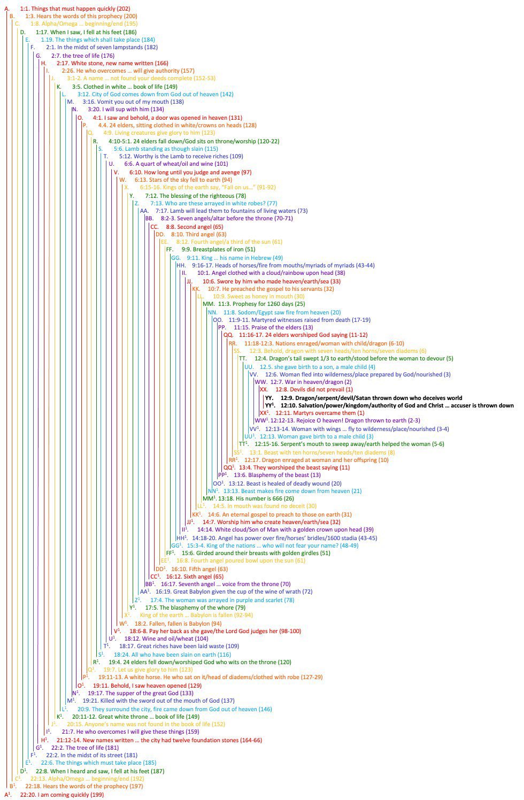

Stacks are everywhere in computer science. When you call function `A` and it calls `B`, 
and then `B` calls `C`, each function execution creates a stack frame and pushes it onto 
the [call stack](https://en.wikipedia.org/wiki/Call_stack).

When `C` is done, the stack frame for `C` is popped off the stack, then `B` is popped, then finally, `A`. 
You can visualize the execution like this:

- push `A`
  - push `B`
     - push `C`
       - push `D`
       - pop `D`
     - pop `C`
  - pop `B`
- pop `A`

This is sometimes called "unwinding the stack".

There is a parallel to this structure in the Bible, it's called a **Chiasm** *(ky-AZ-m)*. It's a way of building up grammatical structures and then reversing those structures like unwinding a stack.

What's extraordinary is how common this is in the Bible. 
The entire Book of Revelation is a Chiasm:

*(credit to [Dean Defuria](https://x.com/_DeanAnthony) )*
